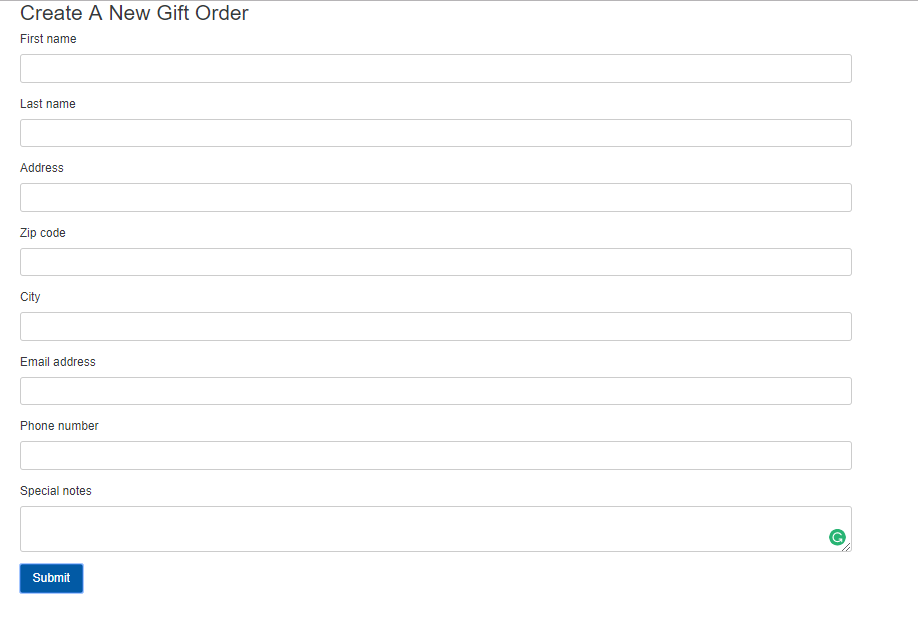
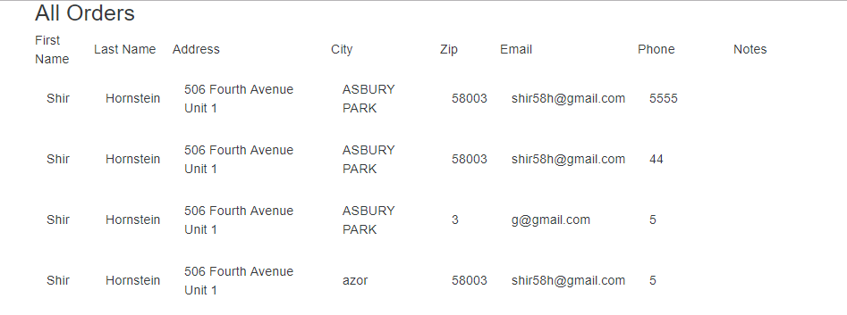

#For Using: ###
    
    > Downloud this repository
    
    for starting client:
    > cd SnappyApp
	> npm install
	> npm start
	
	for starting server:
	>cd snappyApi
	>npm install
	>npm start

	
	  
##For Update a Neo Order: ###
    
    go to: http://localhost:8080/new

####Screenshot ####    
    
    	  
##For see all the orders: ###
    
    go to: http://localhost:8080/all
####Screenshot ###   
        
